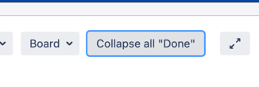
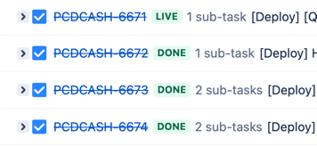

# Collapse Jira Swimlanes

## Introduction

**Collapse Jira Swimlanes** is a browser extension designed to enhance your Jira board experience by injecting a custom button that allows you to collapse all "Done" swimlanes with a single click. This helps in keeping your board clean and focused on the tasks that are still in progress.





## Purpose

The main purpose of this extension is to improve productivity by reducing visual clutter on Jira boards. By collapsing completed swimlanes, users can easily focus on the tasks that need their attention.

## Installation

1. Clone the repository to your local machine:
```sh
git clone https://github.com/ltpquang/collapse-jira-swimlanes.git
```

2. Navigate to the project directory:
```sh
cd collapse-jira-swimlanes
```

3. Open your browser and go to the extensions page:
- For Chrome: `chrome://extensions/`
- For Firefox: `about:addons`

4. Enable "Developer mode" (for Chrome) or "Debug mode" (for Firefox).

5. Click on "Load unpacked" (for Chrome) or "Load Temporary Add-on" (for Firefox) and select the project directory.

6. The extension should now be installed and active.

## Disclaimer

### Icons
Icon used in this project is created by Freepik from Flaticon:
<a href="https://www.flaticon.com/free-icons/justification" title="justification icons">Justification icons created by Freepik - Flaticon</a>

### README
This `README` was generated by GitHub Copilot.
